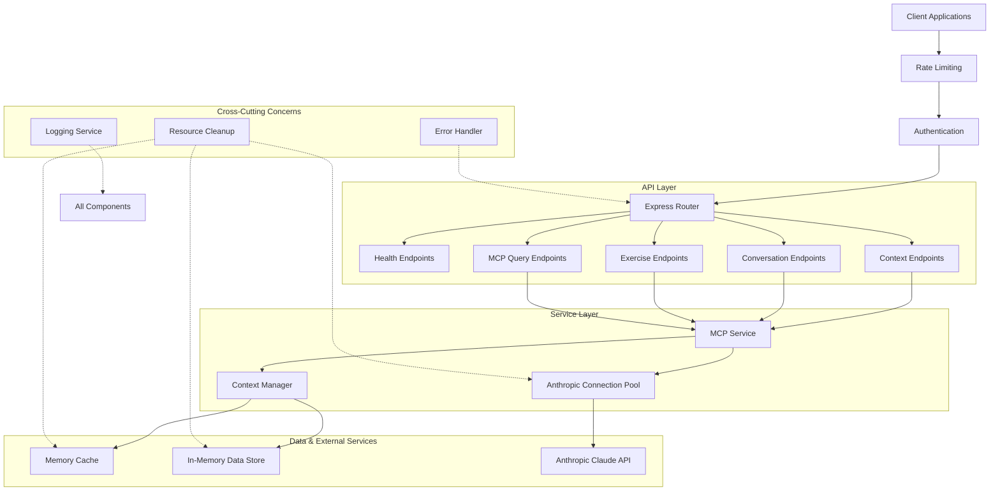
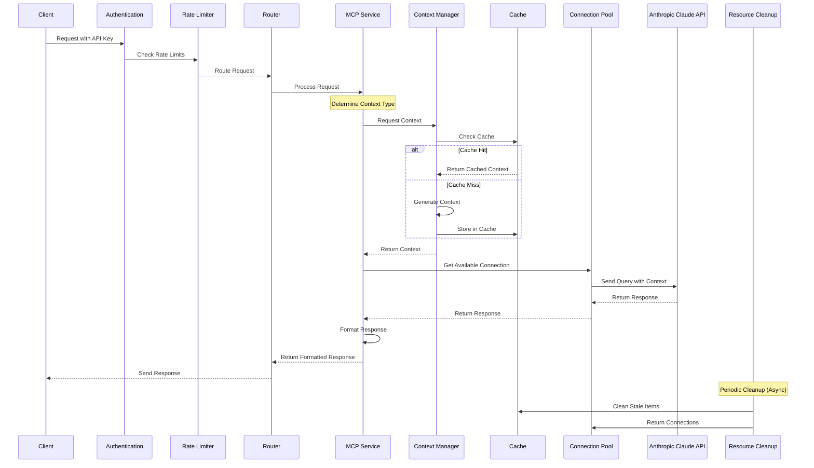
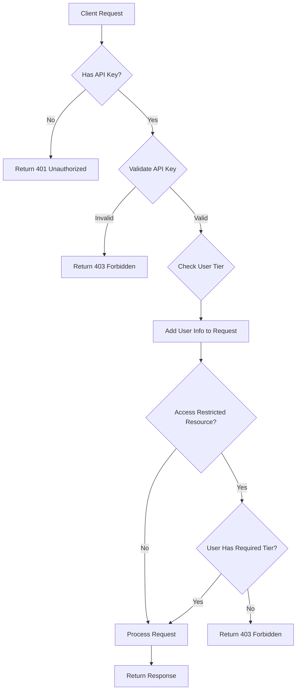

# <div align="center">🌟 Spanish Learning MCP (Model Context Protocol)</div>

# Spanish Learning MCP Server

A server implementation of the Model Context Protocol (MCP) for Spanish language learning, providing tiered access to conversation practice, exercises, and language learning resources.

## Overview

This project has been transformed from a client-side implementation into a full-fledged server, allowing multiple clients to access Spanish learning functionality without directly handling API keys or complex context generation. The server provides a RESTful API with tiered access controls, memory management, and comprehensive error handling.

## Quick Start

Get the Spanish Learning MCP Server up and running in minutes with these quick start steps:

### Prerequisites

- Node.js 16+ and npm
- Anthropic API key (for Claude AI)
- Git

### Installation

```bash
# Clone the repository
git clone https://github.com/yourusername/spanish-learning-mcp-server.git
cd spanish-learning-mcp-server

# Install dependencies
npm install

# Create .env file
echo "ANTHROPIC_API_KEY=your_api_key_here" > .env
```

### Run the Server

```bash
# Start the server in development mode
npm run dev

# Or build and start in production mode
npm run build
npm start
```

The server will be available at http://localhost:3000 with the health check endpoint at http://localhost:3000/health.

### Test Your Setup

Make a simple request to verify your server is working:

```bash
curl http://localhost:3000/health
# Should return {"status":"ok", "uptime": "..."}

# Create an API key (requires admin access)
curl -X POST http://localhost:3000/api/keys \
  -H "Content-Type: application/json" \
  -H "x-admin-key: your_admin_key" \
  -d '{"userId": "test-user", "tier": "free"}'

# Make a query with context
curl -X POST http://localhost:3000/api/mcp/query \
  -H "Content-Type: application/json" \
  -H "x-api-key: your_api_key" \
  -d '{"query": "How do I say hello in Spanish?", "contextType": "vocabulary"}'
```

### Running Tests

The server includes comprehensive test coverage:

```bash
# Run all tests
npm test

# Run specific test suites
npm test -- --testPathPattern=auth
npm test -- --testPathPattern=conversation

# Run tests with coverage report
npm test -- --coverage
```

### Docker Quick Start

```bash
# Build and run with Docker
docker build -t spanish-learning-mcp-server .
docker run -p 3000:3000 -e ANTHROPIC_API_KEY=your_api_key spanish-learning-mcp-server
```

### Platform Integrations

**Deploy to Vercel:**

```bash
npm install -g vercel
vercel
```

**Deploy to Heroku:**

```bash
npm install -g heroku
heroku create
git push heroku main
```

**Run with PM2 (production process manager):**

```bash
npm install -g pm2
pm2 start npm --name "spanish-mcp" -- start
```

## Key Features

### 1. Server Architecture

The server follows a layered architecture with middleware for cross-cutting concerns:



Key architectural components:

- **RESTful API:** Provides endpoints for MCP queries, context retrieval, conversations, and exercises
- **Authentication:** Secure API key-base

This tier structure ensures that users can start with the free tier to explore basic functionality, upgrade to the basic tier for more comprehensive learning features, and access the full suite of advanced capabilities with the premium tier. The system is designed to provide value at every tier while offering clear benefits for upgrading.

### 3. Conversation Functionality

- **Start Conversations:** Initialize conversations on various topics with tier-specific limitations
- **Continue Conversations:** Add messages to existing conversations with context history
- **Conversation History:** View and manage past conversations
- **Delete Conversations:** Remove conversations that are no longer needed
- **Automated Cleanup:** Periodic cleanup of old conversations to prevent memory leaks

### 4. Exercise Functionality

- **Generate Exercises:** Create customized exercises based on difficulty level and topic
- **Check Exercise Answers:** Submit answers and receive feedback
- **Exercise Types:** Various exercise types including vocabulary matching, multiple choice, fill-in-the-blank, etc.
- **Detailed Feedback:** Premium users receive more detailed feedback on their exercises

### 5. Resource Management

- **Memory Management:** Efficient memory usage with automatic cleanup
- **Connection Pooling:** Optimized API client pooling for concurrent requests
- **Caching:** Context and response caching to reduce API calls
- **Graceful Shutdown:** Proper resource cleanup during server shutdown

### 6. Testing and Quality Assurance

- **Unit Tests:** Comprehensive test coverage for all major functionality
- **Integration Tests:** End-to-end testing of API endpoints
- **Error Handling Tests:** Validation of error scenarios
- **Memory Leak Tests:** Verification of memory cleanup functionality
- **Tier-Based Access Tests:** Validation of tier-specific limitations

### 7. Documentation

- **JSDoc Comments:** Complete documentation for all endpoints and functions
- **Type Definitions:** TypeScript type definitions for improved code safety
- **Code Comments:** Clear comments explaining complex logic
- **API Documentation:** Detailed endpoint descriptions with parameter and response information

## Technical Implementation

### System Architecture

The server follows a layered architecture with middleware for cross-cutting concerns:


### MCP Request Flow

The following sequence diagram shows the flow of a typical MCP request through the system:



### Authentication and Authorization Flow



The server is built using:

- **Express.js:** Web framework for handling API requests
- **TypeScript:** Strongly typed language for improved code quality
- **Anthropic Claude API:** AI model for generating responses
- **Jest:** Testing framework for validating functionality
- **Pino:** Structured logging for debugging and monitoring

## Running the Server

```bash
# Install dependencies
npm install

# Set environment variables
export ANTHROPIC_API_KEY=your_api_key
export PORT=3000

# Start the server
npm start
```

## Deployment and Monitoring

### Deployment Options

#### Docker Deployment

The server can be containerized using Docker for consistent deployment across environments:

```dockerfile
FROM node:18-alpine

WORKDIR /app

COPY package*.json ./
RUN npm ci --only=production

COPY . .
RUN npm run build

ENV NODE_ENV=production

EXPOSE 3000

CMD ["node", "dist/server.js"]
```

Build and run the Docker image:

```bash
docker build -t spanish-learning-mcp-server .
docker run -p 3000:3000 -e ANTHROPIC_API_KEY=your_api_key spanish-learning-mcp-server
```

#### Cloud Platform Deployment

The server can be deployed to various cloud platforms:

**AWS Elastic Beanstalk**:

- Upload the application as a ZIP file
- Configure environment variables in the Elastic Beanstalk console
- Enable auto-scaling for handling varying loads

**Google Cloud Run**:

- Build and publish the Docker image to Container Registry
- Deploy to Cloud Run with memory settings optimized for LLM operations (min 1GB recommended)
- Configure concurrency based on expected traffic patterns

**Azure App Service**:

- Use the Node.js App Service plan
- Configure environment variables in the Application Settings
- Set up auto-scaling rules based on CPU/memory usage

#### Serverless Deployment

For lower traffic scenarios, serverless deployment options can be cost-effective:

**AWS Lambda with API Gateway**:

- Package the application using AWS SAM or Serverless Framework
- Configure timeout settings appropriately (LLM requests may need longer timeouts)
- Implement connection pooling carefully due to Lambda's execution model

**Google Cloud Functions**:

- Deploy individual endpoints as separate functions
- Use Pub/Sub for background processing of resource-intensive operations
- Implement proper cleanup for cold starts/stops

### Monitoring and Logging

#### Logging Strategy

The server implements structured logging using Pino, which should be integrated with your monitoring stack:

```javascript
// Example of configuring Pino for production
const logger = pino({
  level: process.env.LOG_LEVEL || "info",
  transport:
    process.env.NODE_ENV === "production"
      ? undefined
      : { target: "pino-pretty" },
  redact: ["req.headers.authorization", "req.headers.x-api-key"],
  formatters: {
    level: (label) => {
      return { level: label };
    },
  },
});
```

For production environments, consider:

- Shipping logs to a centralized logging system (CloudWatch, Stackdriver, ELK Stack)
- Implementing log rotation for self-hosted environments
- Ensuring sensitive data like API keys are properly redacted

#### Metrics Collection

Monitor the following metrics:

1. **Request metrics**:

   - Request rate per endpoint and tier
   - Response times (p50, p95, p99)
   - Error rates by endpoint and error type

2. **Resource metrics**:

   - Memory usage (particularly important for large context operations)
   - CPU utilization
   - Connection pool utilization

3. **Business metrics**:
   - Active users by tier
   - Conversation and exercise creation rates
   - API key usage patterns

Recommended tools include:

- Prometheus + Grafana for self-hosted monitoring
- DataDog, New Relic, or Dynatrace for commercial monitoring
- Cloud-native monitoring services (CloudWatch, Stackdriver) for cloud deployments

#### Health Checks

The server provides a `/health` endpoint that should be used for:

- Load balancer health checks
- Container orchestration health probes
- Alerting on service degradation

Consider extending the health check to include:

- Database connectivity (when implemented)
- Anthropic API availability
- Resource availability checks

### Performance Optimization

#### Connection Pooling

The server uses connection pooling for Anthropic API calls, which should be tuned based on your traffic patterns:

```javascript
// Example tuning for high-traffic environments
const mcpConfig = new McpConfig({
  apiKey: process.env.ANTHROPIC_API_KEY,
  connectionPoolSize: 25, // Adjust based on expected concurrent requests
  connectionPoolTimeout: 60000, // Increase for longer-running requests
  cacheTTL: 1800000, // 30 minutes for production caching
  enableCaching: true,
});
```

#### Caching Strategy

Optimize caching for your workload:

1. **MCP Context Caching**:

   - Increase cache TTL for stable content
   - Implement cache warming for common queries
   - Consider distributed caching (Redis) for multi-instance deployments

2. **Response Caching**:
   - Cache common queries at the API level
   - Implement ETag support for client-side caching
   - Use tiered caching strategies (memory → distributed → persistent)

#### Memory Management

The server includes cleanup routines for memory management that should be tuned for your deployment:

```javascript
// Example of tuning memory cleanup parameters
export const CONVERSATION_MAX_AGE_MS = 14 * 24 * 60 * 60 * 1000; // 14 days retention
const CLEANUP_INTERVAL_MS = 30 * 60 * 1000; // Run cleanup every 30 minutes
```

Consider:

- Shorter retention periods for high-volume deployments
- More frequent cleanup intervals during peak hours
- Implementing memory limits per user/tier
- Using separate processes for memory-intensive operations

### Security Recommendations

#### API Key Security

1. **Key Management**:

   - Rotate API keys regularly
   - Store keys in a secure vault (AWS Secrets Manager, HashiCorp Vault)
   - Implement key revocation processes

2. **Key Usage Policies**:
   - Restrict keys by IP address where possible
   - Implement key-specific rate limits
   - Log all key usage for audit purposes

#### Network Security

1. **TLS Configuration**:

   - Always use HTTPS in production
   - Configure secure TLS parameters (TLS 1.2+, strong ciphers)
   - Implement HSTS headers

2. **API Protection**:
   - Consider using an API gateway for additional security
   - Implement IP-based access controls for admin endpoints
   - Use Web Application Firewall (WAF) rules to protect against common attacks

#### Secure Deployment Practices

1. **Least Privilege**:

   - Run containers/processes as non-root users
   - Use minimal base images (Alpine, distroless)
   - Implement proper network segmentation

2. **Security Scanning**:

   - Scan dependencies for vulnerabilities (npm audit, Snyk)
   - Implement container image scanning
   - Perform regular penetration testing

3. **Data Protection**:
   - Encrypt sensitive data at rest
   - Implement proper data retention policies
   - Ensure compliant handling of user data

#### Authentication and Authorization

1. **Enhanced Authentication**:

   - Consider implementing OAuth2/OIDC for user authentication
   - Add multi-factor authentication for administrative access
   - Implement proper session management

2. **Enhanced Authorization**:
   - Implement attribute-based access control (ABAC)
   - Audit access patterns regularly
   - Enforce principle of least privilege

## API Endpoints

### Public Endpoints

- `GET /health` - Server health check

### Protected Endpoints

- `POST /api/keys` - Create API keys (admin only)
- `GET /api/context` - Retrieve language context
- `POST /api/mcp/query` - Query the MCP with context
- `GET /api/conversation/topics` - Get available conversation topics
- `POST /api/conversation/start` - Start a new conversation
- `POST /api/conversation/continue` - Continue an existing conversation
- `GET /api/conversation/:id` - Get conversation history
- `GET /api/conversation/history` - Get all user conversations
- `DELETE /api/conversation/:id` - Delete a conversation
- `GET /api/exercise/types` - Get available exercise types
- `POST /api/exercise/generate` - Generate exercises
- `POST /api/exercise/check` - Check exercise answers
- `GET /api/exercise/history` - Get exercise history

## Future Enhancements

- Database integration for persistent storage
- User management and authentication
- Analytics and usage tracking
- Additional exercise types and conversation topics
- Mobile client applications

# 🌟 Spanish Learning MCP (Model Context Protocol)

<div align="center">
  
  
  
  
</div>

<div align="center">
  <p><em>A comprehensive implementation of Model Context Protocol for Spanish language learning</em></p>
  <p>Created by Danny Thompson (DThompsonDev) at <a href="https://thisdot.co">This Dot Labs</a></p>
</div>


---

## 🧠 From Client to Server: The MCP Evolution

### What is MCP?

Imagine this:
You're trying to learn Spanish using an AI assistant. One day, you ask it how to say "hello," and it answers just fine. The next day, you ask a grammar question—and it gives you a complex explanation way above your level. It’s like starting a conversation with someone who has no memory of who you are or what you know.

Now flip the script. Imagine that every time you ask a question, the AI remembers:

- You're a beginner.
- You’ve been learning greetings and verbs.
- You like examples with food and travel.

Suddenly, it feels like you’ve got a personal tutor who knows you—and tailors every answer to your level and preferences.

That’s what **Model Context Protocol (MCP)** is all about.

Let’s break down what MCP _actually does_:

### The Four Pillars of MCP

1. **Context Retrieval** – Pulls the _right_ data (like beginner-level verbs or grammar rules) based on the user's question.
2. **Context Formatting** – Structures the data into a markdown format that AI models (like Claude) can easily parse and use.
3. **Context Injection** – Adds that formatted data directly into the system prompt sent to the model.
4. **Response Handling** – Processes what the AI gives back and returns a clean, accurate answer.

---

## 📚 Table of Contents

- [What is Model Context Protocol?](#-what-is-model-context-protocol)
- [Why MCP Matters](#-why-mcp-matters)
- [Project Overview](#-project-overview)
- [Getting Started](#-getting-started)
- [Architecture](#-architecture)
- [How It Works](#-how-it-works)
- [Usage Examples](#-usage-examples)
- [Integrating with Other Projects](#-integrating-with-other-projects)
- [Advanced Topics](#-advanced-topics)
- [Troubleshooting](#-troubleshooting)
- [Contributing](#-contributing)
- [License](#-license)

---

## 🧠 What is Model Context Protocol?

Model Context Protocol (MCP) standardizes interactions between LLMs and external tools/data sources for integrating Large Language Models (LLMs) with domain-specific data to enhance their capabilities. It provides a structured way to:

1. **Retrieve relevant context** from your application's data sources
2. **Format this context** in a way that's optimal for LLM consumption
3. **Inject the context** into prompts sent to the LLM
4. **Process and return responses** in a consistent format

MCP acts as a bridge between your application's data and the LLM, ensuring that the model has access to the most relevant information when generating responses.

### Key Concepts

- **Context Retrieval**: Fetching relevant data based on user queries
- **Context Formatting**: Structuring data in a way that maximizes LLM understanding
- **Context Injection**: Adding the formatted context to prompts
- **Response Processing**: Handling and potentially post-processing LLM responses

---

## 🌈 Why MCP Matters

Traditional LLM integration faces several challenges:

- **Knowledge Cutoffs**: LLMs only know what they were trained on
- **Hallucinations**: Models can generate plausible but incorrect information
- **Lack of Domain Specificity**: Generic responses that don't leverage your data
- **Inconsistent Responses**: Variations in output format and quality

MCP addresses these challenges by:

- **Providing Up-to-Date Information**: Using your application's current data
- **Reducing Hallucinations**: Grounding responses in factual context
- **Enhancing Domain Specificity**: Tailoring responses to your specific use case
- **Ensuring Consistency**: Standardizing how context is provided and responses are formatted

---

## 🔍 Project Overview

This project implements MCP for Spanish language learning, allowing Claude AI to provide accurate, contextual responses about Spanish vocabulary and grammar. It demonstrates:

- How to structure and organize an MCP implementation
- Techniques for context retrieval and formatting
- Methods for integrating with external data sources (Appwrite)
- Approaches for different types of context (vocabulary, grammar, mixed)

### Features

- ✅ Integration with Claude AI via the Anthropic API
- ✅ Context generation from vocabulary and grammar data
- ✅ Appwrite database integration for data storage and retrieval
- ✅ Multiple context types (vocabulary, grammar, mixed)
- ✅ Interactive terminal interface with colored Spanish text highlighting
- ✅ Consistent response formatting for better readability
- ✅ Modular design for easy integration with other projects
- ✅ TypeScript support for type safety and better developer experience
- ✅ Interactive terminal interface for real-time queries
- ✅ Modular design for easy integration with other projects

---

## 🚀 Getting Started

### Prerequisites

- Node.js 16.0.0 or later
- npm or yarn
- An Anthropic API key (for Claude AI)
- Optional: Appwrite account (for database integration)
- Optional: Docker for containerized deployment

### Server Installation

1. **Clone the repository**

   ```bash
   git clone https://github.com/yourusername/spanish-learning-mcp-server.git
   cd spanish-learning-mcp-server
   ```

2. **Install dependencies**

   ```bash
   npm install
   ```

3. **Set up environment variables**

   Create a `.env` file in the root directory with the following variables:

   ```
   # Anthropic API key for Claude (required)
   ANTHROPIC_API_KEY=your_anthropic_api_key
   
   # Server configuration
   PORT=3000
   NODE_ENV=development
   LOG_LEVEL=info
   
   # Admin API key for creating user API keys (use a secure random value)
   ADMIN_API_KEY=your_secure_admin_key
   
   # Appwrite configuration (optional if using the demo with hardcoded data)
   NEXT_PUBLIC_APPWRITE_ENDPOINT=https://cloud.appwrite.io/v1
   NEXT_PUBLIC_APPWRITE_PROJECT_ID=your_appwrite_project_id
   NEXT_PUBLIC_APPWRITE_DATABASE_ID=your_appwrite_database_id
   NEXT_PUBLIC_APPWRITE_VOCABULARY_COLLECTION_ID=your_vocabulary_collection_id
   NEXT_PUBLIC_APPWRITE_GRAMMAR_COLLECTION_ID=your_grammar_collection_id
   ```

4. **Start the server in development mode**

   ```bash
   npm run dev
   ```

   The server will start on http://localhost:3000 with automatic reloading for development.
   
5. **Build and start in production mode**

   ```bash
   npm run build
   npm start
   ```

   For production use, always build the project first and run the optimized version.

6. **Run the server with Docker**

   ```bash
   # Build the Docker image
   docker build -t spanish-mcp-server .
   
   # Run the container
   docker run -p 3000:3000 -e ANTHROPIC_API_KEY=your_key spanish-mcp-server
   ```

### Managing API Keys

The server uses API keys for authentication and tier management. To create API keys:

```bash
# Create a free tier API key
curl -X POST http://localhost:3000/api/keys \
  -H "Content-Type: application/json" \
  -H "x-admin-key: your_admin_key" \
  -d '{"userId": "user1", "tier": "free", "name": "Test User"}'

# Create a premium tier API key
curl -X POST http://localhost:3000/api/keys \
  -H "Content-Type: application/json" \
  -H "x-admin-key: your_admin_key" \
  -d '{"userId": "premium1", "tier": "premium", "name": "Premium User"}'
```

### Testing the Server

Once the server is running, you can test it with various API endpoints:

```bash
# Check server health
curl http://localhost:3000/health

# Test a conversation endpoint with your API key
curl -X GET http://localhost:3000/api/conversation/topics \
  -H "x-api-key: your_api_key"
```

### Client Integration

To connect a frontend application to the server:

```javascript
// Example fetch request
async function queryMCP(question) {
  const response = await fetch('http://localhost:3000/api/mcp/query', {
    method: 'POST',
    headers: {
      'Content-Type': 'application/json',
      'x-api-key': 'your_api_key'
    },
    body: JSON.stringify({
      query: question,
      contextType: 'vocabulary'
    })
  });
  
  return await response.json();
}
```

See our [TESTING_GUIDE.md](./TESTING_GUIDE.md) for comprehensive examples of all endpoints.

---

## 🏗️ Architecture

The project follows a modular architecture designed to separate concerns and make the MCP implementation flexible and extensible.

### Core Components

```
spanish-learning-mcp/
├── contexts/
│   └── claude/
│       └── claude-mcp.ts      # Core MCP implementation
├── examples/
│   ├── spanish-mcp-demo.js    # Comprehensive example with all context types
│   ├── interactive-demo.js    # Interactive terminal interface
│   └── frontend-integration.js # Example of integrating with other frontends
├── lib/
│   ├── appwrite.ts            # Appwrite client and database helpers
│   └── mcp-module.js          # Modular MCP implementation for other projects
├── models/
│   ├── common.ts              # Shared type definitions
│   ├── Grammar.ts             # Grammar model definitions
│   └── Vocabulary.ts          # Vocabulary model definitions
```

### Key Files Explained

- **`contexts/claude/claude-mcp.ts`**: The heart of the MCP implementation. Defines the `ClaudeMcp` class that handles context retrieval, formatting, and interaction with the Claude AI API.

- **`lib/appwrite.ts`**: Provides functions for interacting with the Appwrite database, including retrieving vocabulary and grammar data.

- **`lib/mcp-module.js`**: A modular implementation of the MCP that can be easily imported and used in other projects.

- **`models/*.ts`**: Define the data structures and types used throughout the application, ensuring type safety and consistency.

- **`examples/spanish-mcp-demo.js`**: A comprehensive example that demonstrates how to use the MCP with different types of context.

- **`examples/interactive-demo.js`**: An interactive terminal interface for querying the MCP in real-time.

---

## ⚙️ How It Works

### 1. Context Retrieval

The MCP retrieves context based on the user's query and specified parameters. Here's the actual code from our implementation:

```typescript
// From claude-mcp.ts
async getContext(options: ContextOptions): Promise<string> {
  let contextParts: string[] = [];

  switch (options.contextType) {
    case ContextType.VOCABULARY:
      contextParts.push(await this.getVocabularyContext(options));
      break;
    case ContextType.GRAMMAR:
      contextParts.push(await this.getGrammarContext(options));
      break;
    case ContextType.MIXED:
      contextParts.push(await this.getVocabularyContext(options));
      contextParts.push(await this.getGrammarContext(options));
      break;
    default:
      contextParts.push(await this.getVocabularyContext(options));
  }

  return contextParts.join('\n\n');
}
```

The `getVocabularyContext` method retrieves vocabulary items from the database (or hardcoded data in the demo) based on filters:

```typescript
// From claude-mcp.ts
private async getVocabularyContext(options: ContextOptions): Promise<string> {
  const filters = {};

  if (options.categories?.length) {
    // Filter by category
    const wordCategories = options.categories.filter(
      cat => Object.values(WordCategory).includes(cat as WordCategory)
    ) as WordCategory[];

    if (wordCategories.length > 0) {
      filters.category = wordCategories[0];
    }
  }

  if (options.difficultyLevel) {
    filters.difficultyLevel = options.difficultyLevel;
  }

  if (options.searchTerm) {
    filters.searchTerm = options.searchTerm;
  }

  const result = await getVocabularyItems(
    filters,
    { limit: options.maxItems || 10 }
  );

  return this.formatVocabularyForContext(result.items, options.includeExamples);
}
```

### 2. Context Formatting

The retrieved data is formatted into a structured markdown format that Claude AI can easily understand:

```typescript
// From claude-mcp.ts
private formatVocabularyForContext(items: VocabularyModel[], includeExamples: boolean = true): string {
  if (items.length === 0) {
    return "No vocabulary items found.";
  }

  let context = "# Spanish Vocabulary Reference\n\n";

  // Group by category
  const categorizedItems: Record<string, VocabularyModel[]> = {};

  items.forEach(item => {
    if (!categorizedItems[item.category]) {
      categorizedItems[item.category] = [];
    }
    categorizedItems[item.category].push(item);
  });

  // Format each category and its items
  Object.entries(categorizedItems).forEach(([category, categoryItems]) => {
    context += `## ${this.capitalizeFirstLetter(category)}\n\n`;

    categoryItems.forEach(item => {
      context += `### ${item.word}\n`;
      context += `- **Translation:** ${item.translation}\n`;
      context += `- **Difficulty:** ${item.difficultyLevel}\n`;

      if (item.notes) {
        context += `- **Notes:** ${item.notes}\n`;
      }

      if (includeExamples && item.usageExamples && item.usageExamples.length > 0) {
        context += "\n**Examples:**\n";

        item.usageExamples.forEach((example: any) => {
          context += `- Spanish: ${example.spanish}\n`;
          context += `  English: ${example.english}\n`;

          if (example.explanation) {
            context += `  Explanation: ${example.explanation}\n`;
          }

          context += "\n";
        });
      }

      context += "\n";
    });
  });

  return context;
}
```

This produces a markdown document that looks like:

```markdown
# Spanish Vocabulary Reference

## Greeting

### hola

- **Translation:** hello
- **Difficulty:** beginner

**Examples:**

- Spanish: ¡Hola! ¿Cómo estás?
  English: Hello! How are you?

- Spanish: Hola a todos.
  English: Hello everyone.

### gracias

- **Translation:** thank you
- **Difficulty:** beginner

**Examples:**

- Spanish: Muchas gracias por tu ayuda.
  English: Thank you very much for your help.

- Spanish: Gracias por venir.
  English: Thank you for coming.
```

### 3. Context Injection

The formatted context is injected into the system prompt sent to Claude AI:

```typescript
// From claude-mcp.ts
async queryWithContext(
  userMessage: string,
  contextOptions: ContextOptions
): Promise<string> {
  const context = await this.getContext(contextOptions);

  const systemPrompt = `You are a helpful Spanish language tutor. Use the following Spanish language reference materials to help answer the user's question:\n\n${context}

IMPORTANT: Always format your responses using the following structure:

1. Start with a brief introduction in English
2. For vocabulary words, use this format:
   - [Spanish word/phrase] - [English translation]
3. For useful phrases, use this format:
   - [Spanish phrase]
     [English translation]
4. For grammar explanations, use this format:
   ### [Grammar Topic]
   [Explanation in English]

   Examples:
   - Spanish: [Spanish example]
     English: [English translation]
5. End with a brief conclusion or encouragement in English.`;

  // Send to Claude AI...
}
```

This structured prompt ensures that Claude's responses follow a consistent format, making them easier to read and parse. The format also works well with the Spanish text highlighting in the interactive terminal interface.

In the demo implementation, this looks like:

```javascript
// From spanish-mcp-demo.js
async queryWithContext(userMessage, contextType = 'vocabulary') {
  let context = "";

  // Get the appropriate context based on the type
  switch (contextType) {
    case 'vocabulary':
      context = this.formatVocabularyContext();
      break;
    case 'grammar':
      context = this.formatGrammarContext();
      break;
    case 'mixed':
      context = this.formatVocabularyContext() + "\n\n" + this.formatGrammarContext();
      break;
    default:
      context = this.formatVocabularyContext();
  }

  const systemPrompt = `You are a helpful Spanish language tutor. Use the following Spanish language reference materials to help answer the user's question:\n\n${context}`;

  // Send to Claude AI...
}
```

### 4. Response Processing

The response from Claude AI is processed and returned to the caller:

```typescript
// From claude-mcp.ts
try {
  const response = await this.anthropic.messages.create({
    model: this.config.model,
    max_tokens: this.config.maxTokens,
    temperature: this.config.temperature,
    system: systemPrompt,
    messages: [{ role: "user", content: userMessage }],
  });

  if (response.content[0].type === "text") {
    return response.content[0].text;
  } else {
    return "No text response received from Claude";
  }
} catch (error) {
  console.error("Error querying Claude:", error);
  throw new Error("Failed to get response from Claude");
}
```

---

## 📝 Usage Examples

### Basic Usage

```javascript
import { createClaudeMcp, ContextType } from "./contexts/claude/claude-mcp.js";

// Create an instance of the MCP
const claudeMcp = createClaudeMcp("your_anthropic_api_key");

// Query Claude with vocabulary context
const response = await claudeMcp.queryWithContext(
  'How do I say "hello" in Spanish?',
  {
    contextType: ContextType.VOCABULARY,
    maxItems: 5,
    includeExamples: true,
  }
);

console.log(response);
```

### Using Different Context Types

Here's how to use different context types from our demo implementation:

```javascript
// From spanish-mcp-demo.js
// Vocabulary example
const vocabQuestion = 'How do I say "hello" and "thank you" in Spanish?';
const vocabResponse = await mcp.queryWithContext(vocabQuestion, "vocabulary");

// Grammar example
const grammarQuestion =
  'How do I conjugate the verb "hablar" in the present tense?';
const grammarResponse = await mcp.queryWithContext(grammarQuestion, "grammar");

// Mixed context example
const mixedQuestion =
  'How do I use "gracias" in a sentence with the correct verb conjugation?';
const mixedResponse = await mcp.queryWithContext(mixedQuestion, "mixed");
```

### Interactive Terminal Interface

The interactive terminal interface allows you to query the MCP in real-time:

```javascript
// From interactive-demo.js
const askQuestion = () => {
  rl.question(chalk.green("> "), async (input) => {
    // Check for special commands
    if (input.trim() === "/exit") {
      console.log(chalk.yellow("Goodbye! 👋"));
      rl.close();
      return;
    } else if (input.trim() === "/vocab") {
      contextType = "vocabulary";
      console.log(chalk.yellow(`Switched to vocabulary context`));
      askQuestion();
      return;
    } else if (input.trim() === "/grammar") {
      contextType = "grammar";
      console.log(chalk.yellow(`Switched to grammar context`));
      askQuestion();
      return;
    } else if (input.trim() === "/mixed") {
      contextType = "mixed";
      console.log(chalk.yellow(`Switched to mixed context`));
      askQuestion();
      return;
    }

    // Process the user's question
    if (input.trim()) {
      console.log(
        chalk.blue("Querying Claude with " + contextType + " context...")
      );

      try {
        const response = await mcp.queryWithContext(input, contextType);

        // Highlight Spanish words in the response
        const highlightedResponse = highlightSpanishWords(response);

        console.log(chalk.cyan("Claude's response:"));
        console.log(highlightedResponse);
      } catch (error) {
        console.error(chalk.red("Error:"), error.message);
      }
    }

    // Ask for the next question
    askQuestion();
  });
};
```

### Spanish Text Highlighting

The interactive terminal interface includes a feature to highlight Spanish words and phrases in cyan, making them easier to identify:

````javascript
// From interactive-demo.js
function highlightSpanishWords(text) {
  if (!text) return "";

  // Split the text into lines to process each line separately
  const lines = text.split("\n");
  const processedLines = lines.map((line) => {
    // Skip processing if the line is a code block or URL
    if (line.includes("```") || line.includes("http")) {
      return line;
    }

    // Skip processing if the line is likely an English conclusion
    if (line.includes("Remember") || line.includes("practice")) {
      // Only highlight the Spanish phrase at the end if it exists
      if (line.includes("¡Buen provecho!")) {
        return line.replace(/(¡Buen provecho!)/, chalk.cyan("$1"));
      }
      return line;
    }

    // Process Spanish phrases with dash/hyphen format (common in vocabulary lists)
    if (line.match(/^[-•]\s+([^-]+)\s+-\s+/)) {
      return line.replace(
        /^([-•]\s+)([^-]+)(\s+-\s+)(.+)$/,
        (match, bullet, spanish, separator, english) => {
          return bullet + chalk.cyan(spanish) + separator + english;
        }
      );
    }

    // Process lines with Spanish word/phrase followed by dash and English translation
    if (line.match(/^([^-]+)\s+-\s+/)) {
      return line.replace(
        /^([^-]+)(\s+-\s+)(.+)$/,
        (match, spanish, separator, english) => {
          return chalk.cyan(spanish) + separator + english;
        }
      );
    }

    // Highlight Spanish phrases with special characters
    if (line.includes("Spanish:") || /[áéíóúüñ¿¡]/.test(line)) {
      // If it's a line with "Spanish:" label, highlight everything after the colon
      if (line.includes("Spanish:")) {
        return line.replace(/(Spanish:)(.*)/, (match, label, content) => {
          return label + chalk.cyan(content);
        });
      }

      // Highlight words with Spanish characters
      line = line.replace(/\b\w*[áéíóúüñÁÉÍÓÚÜÑ]\w*\b/g, (match) =>
        chalk.cyan(match)
      );
    }

    return line;
  });

  return processedLines.join("\n");
}
````

This highlighting feature makes it easier to:

- Identify Spanish vocabulary words and phrases
- Distinguish between Spanish and English text
- See the structure of responses clearly
- Focus on the Spanish language elements

---

## 🔌 Integrating with Other Projects

The MCP is designed to be easily integrated with other projects. We provide a modular implementation in `lib/mcp-module.js` that can be imported and used in any JavaScript or TypeScript project.

### Using the MCP Module

```javascript
import {
  createSpanishMcp,
  ContextType,
  ContextOptions,
} from "./lib/mcp-module.js";

// Create an MCP instance with your API key
const mcp = createSpanishMcp("your_anthropic_api_key");

// Query the MCP
const options = new ContextOptions({
  contextType: ContextType.VOCABULARY,
  maxItems: 10,
  includeExamples: true,
});

const response = await mcp.queryWithContext(
  'How do I say "hello" in Spanish?',
  options
);
console.log(response);
```

### Using with Custom Data

You can provide your own vocabulary and grammar data:

```javascript
const customData = {
  vocabulary: [
    {
      word: "hola",
      translation: "hello",
      category: "greeting",
      difficultyLevel: "beginner",
      usageExamples: [
        { spanish: "¡Hola! ¿Cómo estás?", english: "Hello! How are you?" },
        { spanish: "Hola a todos.", english: "Hello everyone." },
      ],
    },
    // More vocabulary items...
  ],
  grammar: [
    {
      title: "Present Tense Conjugation",
      category: "verb_tense",
      difficultyLevel: "beginner",
      explanation:
        "In Spanish, verbs in the present tense change their endings...",
      examples: [
        { spanish: "Yo hablo español.", english: "I speak Spanish." },
        // More examples...
      ],
    },
    // More grammar rules...
  ],
};

const mcp = createSpanishMcp("your_anthropic_api_key", { customData });
```

### Configuring Response Format

The MCP module allows you to customize the format of responses:

```javascript
// Create an MCP instance with custom configuration
const mcp = createSpanishMcp("your_anthropic_api_key", {
  customData,
  model: "claude-3-haiku-20240307", // Use a different Claude model
  maxTokens: 2000, // Increase max tokens
  temperature: 0.5, // Lower temperature for more consistent responses
});
```

### Integration with Different Frameworks

The MCP module is framework-agnostic and can be integrated with various frontend and backend frameworks:

#### React Integration

```jsx
import { useState, useEffect } from "react";
import { createSpanishMcp, ContextType } from "./lib/mcp-module.js";

function SpanishTutor() {
  const [query, setQuery] = useState("");
  const [response, setResponse] = useState("");
  const [loading, setLoading] = useState(false);
  const mcp = createSpanishMcp(process.env.REACT_APP_ANTHROPIC_API_KEY);

  const handleSubmit = async (e) => {
    e.preventDefault();
    setLoading(true);

    try {
      const result = await mcp.queryWithContext(query, {
        contextType: ContextType.MIXED,
      });
      setResponse(result);
    } catch (error) {
      console.error(error);
    } finally {
      setLoading(false);
    }
  };

  return (
    <div>
      <form onSubmit={handleSubmit}>
        <input value={query} onChange={(e) => setQuery(e.target.value)} />
        <button type="submit" disabled={loading}>
          Ask
        </button>
      </form>
      {response && <div>{response}</div>}
    </div>
  );
}
```

#### Express Backend Integration

```javascript
import express from "express";
import { createSpanishMcp, ContextType } from "./lib/mcp-module.js";

const app = express();
app.use(express.json());

// Initialize MCP
const mcp = createSpanishMcp(process.env.ANTHROPIC_API_KEY);

app.post("/api/spanish-tutor", async (req, res) => {
  try {
    const { query, contextType = ContextType.VOCABULARY } = req.body;

    if (!query) {
      return res.status(400).json({ error: "Query is required" });
    }

    const response = await mcp.queryWithContext(query, { contextType });
    res.json({ response });
  } catch (error) {
    res.status(500).json({ error: error.message });
  }
});

app.listen(3000, () => {
  console.log("Server running on port 3000");
});
```

### Integration with React

Here's an example of using the MCP in a React component:

```jsx
import { useState, useMemo } from "react";
import {
  createSpanishMcp,
  ContextType,
  ContextOptions,
} from "../lib/mcp-module.js";

function SpanishTutor() {
  const [query, setQuery] = useState("");
  const [response, setResponse] = useState("");
  const [contextType, setContextType] = useState(ContextType.VOCABULARY);
  const [isLoading, setIsLoading] = useState(false);

  // Initialize MCP
  const mcp = useMemo(() => {
    return createSpanishMcp("your_anthropic_api_key");
  }, []);

  const handleSubmit = async (e) => {
    e.preventDefault();

    if (!query.trim()) return;

    setIsLoading(true);

    try {
      const options = new ContextOptions({
        contextType,
        maxItems: 10,
        includeExamples: true,
      });

      const result = await mcp.queryWithContext(query, options);
      setResponse(result);
    } catch (error) {
      console.error("Error:", error);
      setResponse("Error: " + error.message);
    } finally {
      setIsLoading(false);
    }
  };

  return (
    <div>
      <h1>Spanish Tutor</h1>

      {/* Context type selector */}
      <div>
        <label>
          <input
            type="radio"
            value={ContextType.VOCABULARY}
            checked={contextType === ContextType.VOCABULARY}
            onChange={() => setContextType(ContextType.VOCABULARY)}
          />
          Vocabulary
        </label>

        {/* Other radio buttons... */}
      </div>

      {/* Query form */}
      <form onSubmit={handleSubmit}>
        <textarea
          value={query}
          onChange={(e) => setQuery(e.target.value)}
          placeholder="Ask a question about Spanish..."
        />

        <button type="submit" disabled={isLoading}>
          {isLoading ? "Loading..." : "Ask"}
        </button>
      </form>

      {/* Response display */}
      {response && (
        <div>
          <h2>Response:</h2>
          <div>{response}</div>
        </div>
      )}
    </div>
  );
}
```

## Integration with Express Backend

```javascript
import express from "express";
import {
  createSpanishMcp,
  ContextType,
  ContextOptions,
} from "../lib/mcp-module.js";

const app = express();
app.use(express.json());

// Initialize MCP
const apiKey = process.env.ANTHROPIC_API_KEY;
const mcp = createSpanishMcp(apiKey, {
  useAppwrite: true, // Use Appwrite for data instead of custom data
});

// API endpoint for querying the MCP
app.post("/api/spanish-tutor", async (req, res) => {
  try {
    const { query, contextType = ContextType.VOCABULARY } = req.body;

    if (!query) {
      return res.status(400).json({ error: "Query is required" });
    }

    const options = new ContextOptions({
      contextType,
      maxItems: 10,
      includeExamples: true,
    });

    const response = await mcp.queryWithContext(query, options);

    res.json({ response });
  } catch (error) {
    console.error("Error:", error);
    res.status(500).json({ error: error.message });
  }
});

app.listen(3000, () => {
  console.log("Server running on port 3000");
});
```

### Platform-Specific Integrations

#### Next.js Integration

For Next.js applications, you can create an API route that uses the MCP module:

```javascript
// pages/api/spanish-tutor.js
import { createSpanishMcp, ContextType } from "../../lib/mcp-module.js";

// Initialize MCP outside of handler to reuse connections
const mcp = createSpanishMcp(process.env.ANTHROPIC_API_KEY, {
  connectionPoolSize: 5, // Optimize for serverless
});

export default async function handler(req, res) {
  if (req.method !== "POST") {
    return res.status(405).json({ error: "Method not allowed" });
  }

  try {
    const { query, contextType = ContextType.VOCABULARY } = req.body;

    if (!query) {
      return res.status(400).json({ error: "Query is required" });
    }

    const response = await mcp.queryWithContext(query, { contextType });

    res.status(200).json({ response });
  } catch (error) {
    console.error("Error processing request:", error);
    res
      .status(500)
      .json({ error: "An error occurred while processing your request" });
  }
}
```

#### NestJS Integration

For NestJS applications, create a service and controller:

```typescript
// spanish.service.ts
import { Injectable } from "@nestjs/common";
import { createSpanishMcp, ContextType } from "../lib/mcp-module.js";

@Injectable()
export class SpanishService {
  private mcp;

  constructor() {
    this.mcp = createSpanishMcp(process.env.ANTHROPIC_API_KEY);
  }

  async queryWithContext(
    query: string,
    contextType: string = ContextType.VOCABULARY
  ) {
    return this.mcp.queryWithContext(query, { contextType });
  }
}

// spanish.controller.ts
import { Controller, Post, Body } from "@nestjs/common";
import { SpanishService } from "./spanish.service";

@Controller("spanish")
export class SpanishController {
  constructor(private readonly spanishService: SpanishService) {}

  @Post("query")
  async query(@Body() body: { query: string; contextType?: string }) {
    const { query, contextType } = body;
    const response = await this.spanishService.queryWithContext(
      query,
      contextType
    );
    return { response };
  }
}
```

#### Firebase Cloud Functions Integration

For serverless Firebase deployments:

```javascript
// functions/index.js
const functions = require("firebase-functions");
const { createSpanishMcp, ContextType } = require("./lib/mcp-module.js");

// Initialize MCP with connection pooling optimized for serverless
const mcp = createSpanishMcp(process.env.ANTHROPIC_API_KEY, {
  connectionPoolSize: 1, // Lower for serverless
  cacheTTL: 3600000, // 1 hour cache for serverless efficiency
});

exports.spanishTutor = functions.https.onRequest(async (req, res) => {
  // Set CORS headers
  res.set("Access-Control-Allow-Origin", "*");

  if (req.method === "OPTIONS") {
    res.set("Access-Control-Allow-Methods", "POST");
    res.set("Access-Control-Allow-Headers", "Content-Type");
    res.status(204).send("");
    return;
  }

  if (req.method !== "POST") {
    res.status(405).send("Method Not Allowed");
    return;
  }

  try {
    const { query, contextType = ContextType.VOCABULARY } = req.body;

    if (!query) {
      res.status(400).send({ error: "Query is required" });
      return;
    }

    const response = await mcp.queryWithContext(query, { contextType });
    res.status(200).send({ response });
  } catch (error) {
    console.error("Error:", error);
    res.status(500).send({ error: error.message || "Internal Server Error" });
  }
});
```

````

---

## 🔬 Advanced Topics

### Customizing Context Retrieval

You can customize how context is retrieved by modifying the `getVocabularyContext` and `getGrammarContext` methods in `claude-mcp.ts`. For example, you might want to:

```typescript
// Example: Adding semantic search to getVocabularyContext
private async getVocabularyContext(options: ContextOptions): Promise<string> {
  // ... existing code ...

  // Add semantic search
  if (options.semanticQuery) {
    const embeddings = await this.getEmbeddings(options.semanticQuery);
    const semanticResults = await this.searchByEmbeddings(embeddings);

    // Combine with other results or use directly
    result.items = [...result.items, ...semanticResults];
  }

  return this.formatVocabularyForContext(result.items, options.includeExamples);
}
````

### Optimizing Context Format

The format of the context can significantly impact the quality of responses. Consider:

```typescript
// Example: Enhanced formatting with additional metadata
private formatVocabularyForContext(items: VocabularyModel[], includeExamples: boolean = true): string {
  // ... existing code ...

  // Add metadata section to help the model understand the structure
  context = "# Spanish Vocabulary Reference\n\n" +
    "## Metadata\n" +
    `- Total items: ${items.length}\n` +
    `- Categories: ${Array.from(new Set(items.map(item => item.category))).join(', ')}\n` +
    `- Difficulty levels: ${Array.from(new Set(items.map(item => item.difficultyLevel))).join(', ')}\n\n` +
    context;

  return context;
}
```

### Extending the MCP

The MCP can be extended to support additional features:

```typescript
// Example: Adding conversation history support
export interface ConversationContext {
  history: { role: 'user' | 'assistant', content: string }[];
}

async queryWithContextAndHistory(
  userMessage: string,
  contextOptions: ContextOptions,
  conversationContext: ConversationContext
): Promise<string> {
  const context = await this.getContext(contextOptions);

  const systemPrompt = `You are a helpful Spanish language tutor. Use the following Spanish language reference materials to help answer the user's question:\n\n${context}`;

  // Include conversation history in the messages
  const messages = [
    ...conversationContext.history,
    { role: 'user', content: userMessage }
  ];

  // Send to Claude AI...
}
```

---

## ❓ Troubleshooting

### Common Issues

**Issue**: API key errors when running the demo
**Solution**: Ensure your Anthropic API key is correctly set in `.env.local`

**Issue**: Module resolution errors
**Solution**: The project uses a mixed module system with NodeNext resolution. Ensure your imports use the correct file extensions (.js for ES modules, .mjs for explicit ES modules).

**Issue**: TypeScript errors
**Solution**: Run `npm run build` to check for TypeScript errors. Make sure you're using Node.js 16+ and TypeScript 5+.

### Debugging Tests

**Issue**: Tests fail with timeouts
**Solution**: Some tests may time out if rate limiting is happening. Add `jest.setTimeout(30000)` to increase timeout, or use the `--testTimeout=30000` flag.

**Issue**: Tests fail with auth errors
**Solution**: Ensure your test environment includes mock API keys or proper auth setup in `.env.test`.

**Issue**: Memory issues during testing
**Solution**: Run tests with `NODE_OPTIONS="--max-old-space-size=4096" npm test` to allocate more memory.

### Common Error Codes

| Error Code | Description               | Solution                                       |
| ---------- | ------------------------- | ---------------------------------------------- |
| `AUTH_001` | Invalid API key           | Check your API key in headers or env variables |
| `AUTH_002` | Insufficient tier access  | Upgrade to a higher tier or modify your query  |
| `RATE_001` | Rate limit exceeded       | Wait before trying again or upgrade tier       |
| `MCP_001`  | Context generation failed | Check your query and context parameters        |
| `MCP_002`  | Claude API error          | Check logs for detailed error from Anthropic   |

---

## 🤝 Contributing

Contributions are welcome! Please feel free to submit a Pull Request.

1. Fork the repository
2. Create your feature branch (`git checkout -b feature/amazing-feature`)
3. Commit your changes (`git commit -m 'Add some amazing feature'`)
4. Push to the branch (`git push origin feature/amazing-feature`)
5. Open a Pull Request

---

## 📄 License

This project is licensed under the MIT License - see the LICENSE file for details.

---

<div align="center">
  <p>Made with ❤️ by Danny Thompson (DThompsonDev) at This Dot Labs</p>
  <p>
    <a href="https://twitter.com/dthompsondev">Twitter</a> •
    <a href="https://github.com/dthompsondev">GitHub</a> •
    <a href="https://thisdot.co">This Dot Labs</a>
  </p>
</div>
